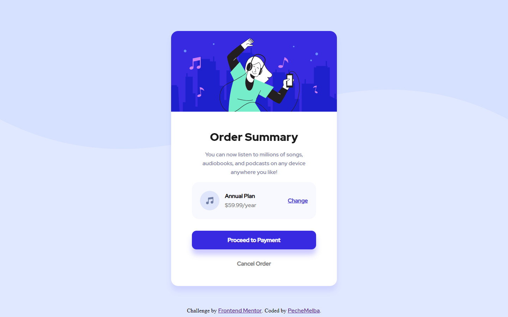

# Frontend Mentor - Order summary card solution

This is a solution to the [Order summary card challenge on Frontend Mentor](https://www.frontendmentor.io/challenges/order-summary-component-QlPmajDUj). Frontend Mentor challenges help you improve your coding skills by building realistic projects. 

## Table of contents

- [Overview](#overview)
  - [The challenge](#the-challenge)
  - [Screenshot](#screenshot)
  - [Links](#links)
- [My process](#my-process)
  - [Built with](#built-with)
  - [What I learned](#what-i-learned)
  - [Continued development](#continued-development)
- [Author](#author)

## Overview

### The challenge

Users should be able to:

- See hover states for interactive elements

### Screenshot

### Links

- Solution URL: [Add solution URL here](https://your-solution-url.com)

## My process

### Built with

- HTML
- CSS
- Flexbox

### What I learned

It was my fisrt project as a frontend beginner. I learned how to do some responsive design with media queries.
I also learned how to organize a project and estimate time to develop each part it.
It was very interesting but I've spent an incredibly time on it, I hope I will be faster and more confident with the next challenge.

### Continued development

Hardest part for me was organizing the CCS. Especially managing to have the same marging between elements with Flexbox.
I really want to improve my skills using Flexbox fluently. I've lost too much time on it. There are some behaviors I still can't understand now.
I'm sure the way I did it is not the best so if you have any advises feel free to suggest me alternative ideas.
I'm pressed to start a new challenge and becoming more confortable with that tool.

## Author

- Frontend Mentor - [@PecheMelba](https://www.frontendmentor.io/profile/PecheMelba)